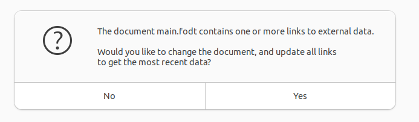

## Ideas/plans for splitting the document

This is work in progress. I describe some of the attempts I have tried to split the document.

### Creating a master document and sub documents using builtin methods

See the LibreOffice help section about [master documents](https://help.LibreOffice.org/latest/en-US/text/swriter/guide/globaldoc.html). This requires that we start with an empty master document and fill in the
sub document files. So first step will be to split the full OPM manual document into sub documents.

The most simple way to split the document would be to use the split method that is already built into
LibreOffice, see the LibreOffice writer guide, [chapter 16](https://books.LibreOffice.org/en/WG72/WG7216-MasterDocuments.html#toc18). I was able to split the file into sub files according to the
[outline level](https://help.LibreOffice.org/latest/he/text/swriter/01/05030800.html) using this method,
but when I tried to insert the sub documents back into the master document in the [navigator](https://help.LibreOffice.org/latest/ro/text/swriter/01/02110000.html) it crashed. Probably because of the size of the document.

However, the recommended approach for working with master and sub documents is to start with an empty master document,
see LibreOffice writer guide, [chapter 16](https://books.LibreOffice.org/en/WG72/WG7216-MasterDocuments.html#toc9), but obviously we cannot use this approach since the document has already been created.

In addition, preliminary experiments with a minimal "test" master document and then adding some minimal sub document files to the
master document indicates that internal links between sub documents does not work after exporting the master
document to PDF format.

Another complication with this approach is that the file format is changed from FODT to ODT when the splitting is done. This makes it more difficult to work with the files from Python.

### Creating a master document by preprocessing in Python

Another alternative for splitting the document is investigated: A python script is used to remove the [body part of the document](https://docs.oasis-open.org/office/OpenDocument/v1.3/os/part3-schema/OpenDocument-v1.3-os-part3-schema.html#__RefHeading__440370_826425813) and only leave the styling, fonts, settings, and metadata in the modified document. Preliminary tests indicate that this can be done such that LibreOffice still recognizes the modified document as a valid document.

This stripped down document becomes around 75% smaller than the original document and therefore more manageable.

The plan is then to convert this stripped down document into a master document as described in the previous section, see also the LibreOffice writer guide, [chapter 16](https://books.LibreOffice.org/en/WG72/WG7216-MasterDocuments.html#toc18). Then, use another Python script to extract subsections and metadata from the original document. Based on these extracted parts the Python script should be able to reconstruct a
valid flat ODT document that contains only a subsection of the original document but has the same
metadata as the original document.

The next step is to try to import this FODT sub document into the generated master document, we created in the previous step. See step #6 in [Starting with no existing documents](https://books.LibreOffice.org/en/WG72/WG7216-MasterDocuments.html#toc9) in the LibreOffice writer guide.

Note that even if this procedure should work, there might still be an issue with representing links between sub documents in the exported PDF version of the master document.

### Rewriting the document to include read-only sections from sub documents

This is the approach I am currently focusing on. A python script is used to extract metadata, attributes and
parts representing each chapter in the original document. Then, another Python script is used to create
valid FODT documents from the extracted parts. In these sub documents the extracted chapter part is wrapped inside a [text:section](https://docs.oasis-open.org/office/OpenDocument/v1.3/os/part3-schema/OpenDocument-v1.3-os-part3-schema.html#__RefHeading__1415162_253892949) element with specific identifier. Then, a third python script is used to remove all the chapters from the original document and insert hyperlinks to
the specific sections inside the sub documents, see [Inserting Sections](https://help.LibreOffice.org/latest/en-US/text/swriter/guide/section_insert.html) in LibreOffice Help. Note that the original document is still valid if the sub documents should be deleted (provided you save the original document at least once), implying that LibreOffice duplicates the included sections from the sub documents in the original document. However, those included sections are read-only and can not be modified from the original document.

In order to reduce the size of the sub documents, the
[automatic styling](https://docs.oasis-open.org/office/OpenDocument/v1.3/os/part3-schema/OpenDocument-v1.3-os-part3-schema.html#__RefHeading__1415058_253892949)
metadata from the main document is preprocessed such that only the styles that are actually used
in the sub document are included. This reduced the size of a sub document by up to 30 Mb.

When I tested this, the main document was originally 75 Mb. The new document after removing 12 chapters,
and inserting links to sections from the sub documents was 37 Mb. However, if you resave the document after loading it in, LibreOffice will reinsert the sections (as mentioned above) and the saved document becomes 69 Mb. The size of each of the 12 sub documents
was around 25 Mb. However, after removing automatic styles that was not used (as mentioned above) the size dropped to around 5 Mb.

Each sub document could now be edited separately without LibreOffice freezing due to the size of the document.

However, one should not try to use the menu `Tools->Update->Update All` from the generated new main
document after you have edited a sub document (and saved it). When I tested this, LibreOffice froze
for 5 minutes before I decided to kill it. Rather, close and save the sub documents after you have
edited it. Then, open the main document and LibreOffice will show the following dialog:

Click "Yes" and wait (I waited approximately 30 seconds). It will then open the document with the newly edited sub documents. You can then choose `File->Export As->Export As PDF...` to create the main
PDF manual.

### Manually compiling a document from sub documents with a Python script

If it turns out that the methods described in the previous sections fails, we may have to try to compile a master document manually (without the help from LibreOffice) using a Python script.

